# C4 — Nível 3: Componentes do backend

Olha **dentro do container `api`** e mostra os componentes lógicos
seguindo a Arquitetura Hexagonal (ver [ADR-002](../adr/ADR-002-hexagonal-architecture.md)).

```mermaid
C4Component
    title Componentes — API Backend (FastAPI)

    Container(spa, "SPA Frontend", "React")
    ContainerDb(db, "PostgreSQL", "RDBMS")
    System_Ext(fx, "Provedor de Câmbio")

    Container_Boundary(api, "API Backend") {
        Component(routers, "Routers v1", "FastAPI APIRouter", "assignors, receivables, pricing, settlements, exchange_rates, reports, product_types")
        Component(schemas, "Schemas Pydantic v2", "Pydantic", "Validação e serialização HTTP")
        Component(deps, "Composition Root", "deps.py", "Injeção de dependência: monta repositórios, conversor, serviços")
        Component(errors, "Error Translator", "errors.py", "Mapeia DomainError → HTTPException")

        Boundary(domain, "domain/", "domínio puro") {
            Component(entities, "Entities", "dataclass", "Assignor, Receivable, Settlement, ExchangeRate")
            Component(vos, "Value Objects", "dataclass frozen", "Money, Cnpj, DateRange")
            Component(ports, "Ports", "Protocol", "ReceivableRepository, CurrencyConverter, ...")
            Component(services, "Domain Services", "callable", "Orquestram entidades + portas")
            Component(pricing, "Pricing Engine", "pure functions", "Juros simples/composto, taxas, fees")
            Component(analytics, "Analytics", "pure functions", "Sumarizações de carteira")
        }

        Boundary(infra, "infrastructure/", "adaptadores de saída") {
            Component(models, "ORM Models", "SQLAlchemy 2.0", "Mapeamento Python ↔ tabela")
            Component(mappers, "Mappers", "puros", "Entity ↔ ORM model")
            Component(repos, "Repositories", "implementação", "Implementam portas de repositório")
            Component(dbfx, "DatabaseCurrencyConverter", "cache em DB", "Implementa CurrencyConverter com TTL")
        }

        Boundary(res, "resilience/", "decorators") {
            Component(retry, "with_retries", "tenacity", "Exponential backoff + jitter")
            Component(breaker, "with_circuit_breaker", "purgatory", "Threshold + recovery")
            Component(resilient, "ResilientCurrencyConverter", "decorator", "Empilha retry+breaker em torno de HTTP client")
        }

        Boundary(obs, "observability/", "instrumentação") {
            Component(otel, "OTel Setup", "tracer + meter", "Spans + métricas")
            Component(logger, "structlog", "JSON logs", "Logs com trace_id")
            Component(prom, "Prometheus Exporter", "/metrics", "Scrape endpoint")
        }
    }

    Rel(spa, routers, "HTTP /api/v1/*")
    Rel(routers, schemas, "valida payload")
    Rel(routers, deps, "obtém serviços")
    Rel(routers, errors, "captura DomainError")

    Rel(deps, services, "instancia")
    Rel(deps, repos, "instancia")
    Rel(deps, resilient, "compõe")

    Rel(services, ports, "depende de")
    Rel(services, entities, "manipula")
    Rel(services, pricing, "delega cálculo")

    Rel(repos, ports, "implementa")
    Rel(repos, mappers, "usa")
    Rel(mappers, models, "lê/escreve")
    Rel(models, db, "SQL")

    Rel(resilient, retry, "envolve")
    Rel(retry, breaker, "envolve")
    Rel(breaker, fx, "HTTP")
    Rel(dbfx, resilient, "fallback ao provedor")
    Rel(dbfx, db, "cache lookup/write")

    UpdateRelStyle(spa, routers, $offsetY="-10")
```



## Regras de dependência

1. **`domain/` é o núcleo.** Não importa nada de `api/`, `infrastructure/`,
   `resilience/`, `observability/`.
2. **`api/v1/` orquestra.** Importa `domain/` (portas e entidades) e
   `infrastructure/` apenas através do Composition Root (`deps.py`).
3. **`infrastructure/` implementa portas.** Pode importar
   `domain/` (entidades + portas) mas o contrário é proibido.
4. **`resilience/` envolve `CurrencyConverter`.** Composição feita em
   `deps.py`.
5. **`observability/` é transversal.** Acessível por qualquer camada via
   `logger`/`tracer`/`meter` — mas nunca como dependência de domínio.

## Fluxo de uma requisição de pricing

```
POST /api/v1/pricing
  └─ router.pricing.create_pricing
      └─ deps.get_pricing_service()  ──┐
      └─ PricingService.price()       │ DI compõe:
          ├─ ReceivableRepository.get_by_id()    ← infra/repositories
          ├─ CurrencyConverter.convert()         ← cache (DB) →
          │     ├─ hit → retorna cotação        │  resilient (retry+breaker) →
          │     └─ miss → busca provedor        │  HTTP client → AwesomeAPI
          ├─ PricingEngine.calculate()          ← domain/pricing (puro)
          └─ ReceivableRepository.save()
      └─ schema.PricingResponse.model_validate()
```

Tudo correlacionado pelo mesmo `trace_id` (OTel) e logs estruturados
(structlog).
