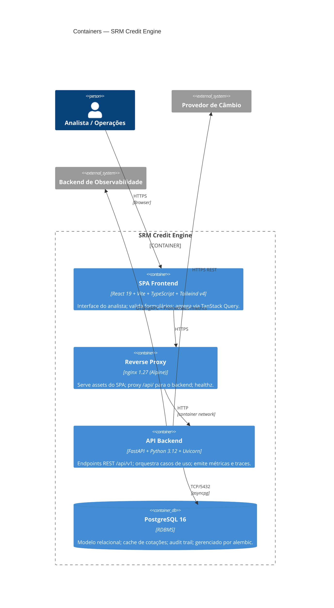

# C4 — Nível 2: Containers

Decomposição do **SRM Credit Engine** em peças executáveis (processos
e armazenamentos).

## Containers

### `frontend` (SPA + nginx)

- **Build:** Vite produz `dist/` estático.
- **Runtime:** nginx 1.27-alpine; SPA fallback; gzip; cache longo em
  `/assets/`; proxy `/api/ → backend:8000/api/`.
- **Healthcheck:** `/healthz` (200 OK estático).
- **Stateless;** escala horizontal pura.

### `backend` (FastAPI)

- **Stateless** — sessão SQLAlchemy criada por request.
- **Concorrência:** Uvicorn com workers; cada worker é um event loop
  async.
- **Endpoints:** `/api/v1/{assignors,receivables,pricing,settlements,...}`,
  `/metrics`, `/health`, `/health/ready`.
- **Migrações:** `entrypoint.sh` roda `alembic upgrade head` antes do
  `uvicorn` (gate por `RUN_MIGRATIONS=true`).
- **Resiliência interna:** retry + circuit breaker + cache em DB para
  câmbio.

### `db` (PostgreSQL 16)

- **Stateful** — volume named `pgdata` no docker-compose; em produção
  usar managed service (RDS, Cloud SQL).
- **Esquema:** ver [`docs/ER.md`](../ER.md).
- **Pool:** SQLAlchemy `asyncpg` driver, pool size configurável
  (`DATABASE_POOL_SIZE`).
- **Backup:** `pg_dump` lógico + WAL archiving em produção.

## Comunicação inter-container

| De        | Para  | Protocolo  | Padrão                |
| --------- | ----- | ---------- | --------------------- |
| browser   | nginx | HTTPS      | request/response      |
| nginx     | api   | HTTP (rede interna) | reverse-proxy   |
| api       | db    | TCP        | pool de conexões      |
| api       | fx    | HTTPS      | client com timeout 3s |
| api       | otel  | OTLP/gRPC  | export assíncrono     |

## Operação

- **Local:** `docker compose up --build` (ver `docker-compose.yml`).
- **CI/CD:** workflows publicam imagens (futuro), validam compose.
- **Configuração:** 100% via variáveis de ambiente — ver `.env.example`.
