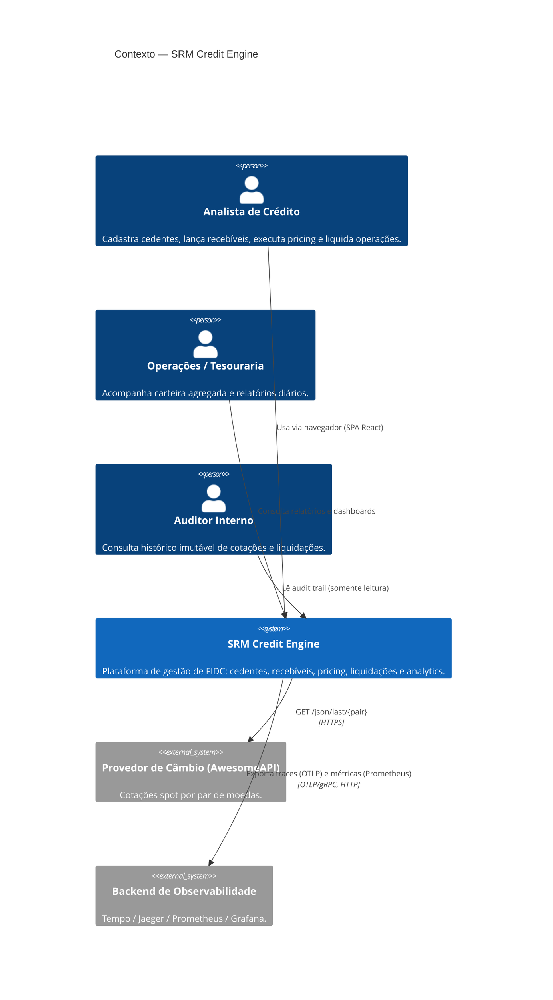

# C4 — Nível 1: Contexto do sistema

Visão de **mais alto nível**: o sistema como caixa única, suas pessoas
e seus integrantes externos.

## Pessoas (atores)

| Ator                     | Necessidade primária                                              |
| ------------------------ | ----------------------------------------------------------------- |
| **Analista de Crédito**  | Cadastrar cedente, lançar recebível, precificar e liquidar.       |
| **Operações/Tesouraria** | Visão consolidada da carteira; conciliação diária.                |
| **Auditor Interno**      | Audit trail imutável de cotações usadas e operações realizadas.   |

## Sistemas externos

| Sistema             | Propósito                                            | Tipo de integração       |
| ------------------- | ---------------------------------------------------- | ------------------------ |
| **AwesomeAPI**      | Cotação spot para precificação em moeda estrangeira. | HTTPS REST, pull, cache. |
| **Coletor OTel**    | Tracing distribuído e métricas.                      | OTLP/gRPC saindo.        |
| **Prometheus**      | Scrape de métricas em `/metrics`.                    | HTTP entrando.           |

## Princípios de fronteira

- **Nenhum sistema externo no caminho crítico de leitura** — pricing
  serve a partir do cache de cotações no PostgreSQL quando possível.
- **Auditoria nunca depende do provedor de câmbio** — toda cotação usada
  vira linha em `exchange_rate`.
- **Observabilidade nunca bloqueia o request** — OTel é exportador
  assíncrono.
