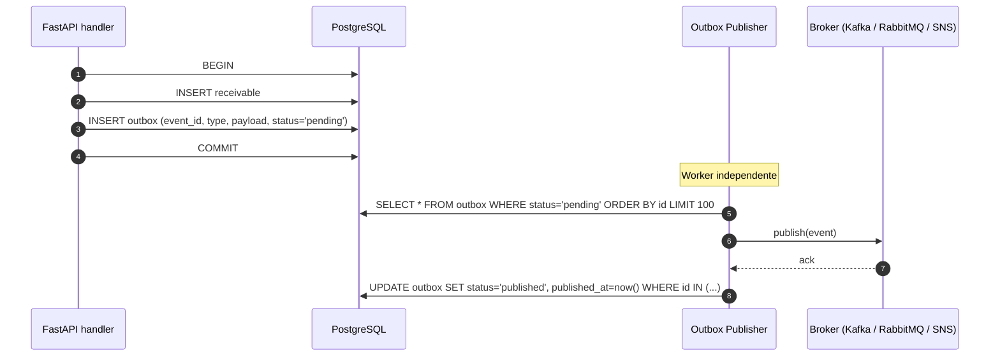

# Event-Driven Architecture — outbox e roadmap

Hoje o **SRM Credit Engine** é **request-response síncrono**. Integrações
externas (futuras: ledger, sistema antifraude, notificações) e
escalabilidade de leitura (CQRS) exigirão eventos. Este documento
define o **caminho mínimo** para isso, sem refatoração disruptiva.

## Princípios

1. **A fonte da verdade é o PostgreSQL.** Eventos não substituem a
   transação relacional; são derivados dela.
2. **Outbox transacional** garante _exactly-once_ relativo ao banco —
   o evento só é publicado se a transação foi commitada.
3. **Eventos são fatos imutáveis em pretérito** —
   `ReceivableCreated`, `SettlementCompleted`. Nunca comandos.
4. **Versionamento explícito** — `type` + `version` no envelope.
5. **Idempotência no consumidor** — `event_id` é UUID; consumidor
   guarda último processado por chave.

## Padrão: Transactional Outbox



### Tabela `outbox`

| Coluna         | Tipo                | Observação                                |
| -------------- | ------------------- | ----------------------------------------- |
| `id`           | bigserial PK        | ordem de inserção                         |
| `event_id`     | uuid UNIQUE NOT NULL| identidade do evento                      |
| `tenant_id`    | uuid NOT NULL       | particionamento futuro                    |
| `type`         | text NOT NULL       | `receivable.created`                      |
| `version`      | smallint NOT NULL   | esquema do payload                        |
| `aggregate_id` | uuid NOT NULL       | ID da entidade origem                     |
| `payload`      | jsonb NOT NULL      | snapshot mínimo + identificadores         |
| `status`       | text NOT NULL       | `pending` \| `published` \| `dead`        |
| `attempts`     | smallint NOT NULL   | reentregas                                |
| `created_at`   | timestamptz NOT NULL| na transação original                     |
| `published_at` | timestamptz NULL    | após ack do broker                        |

Índices:
- `(status, id)` para o publisher.
- `(aggregate_id, type)` para auditoria.

### Publisher

- Worker dedicado (processo separado, mesma codebase).
- Lê batch, publica, marca como `published`.
- Falha do broker: incrementa `attempts`; após N → `dead` (DLQ no
  próprio banco; alarme).
- **At-least-once** garantido; consumidor é responsável pela
  idempotência.

## Catálogo de eventos (proposto)

| Tipo                          | Disparador                              | Consumidores futuros                     |
| ----------------------------- | --------------------------------------- | ---------------------------------------- |
| `assignor.created`            | `POST /assignors`                       | KYC, antifraude                          |
| `assignor.updated`            | `PATCH /assignors/{id}`                 | KYC                                      |
| `receivable.created`          | `POST /receivables`                     | analytics read-model                     |
| `receivable.priced`           | `POST /pricing` (resultado persistido)  | ledger, dashboard real-time              |
| `settlement.requested`        | `POST /settlements`                     | payment gateway                          |
| `settlement.completed`        | confirmação de pagamento                | ledger, notificação ao cedente           |
| `exchange_rate.fetched`       | nova cotação obtida do provedor         | replicação para read-model de analytics  |

### Envelope

```json
{
  "event_id": "0190f0c2-...-7b3a",
  "tenant_id": "9c7f...-...",
  "type": "receivable.priced",
  "version": 1,
  "aggregate_id": "...",
  "occurred_at": "2026-04-12T15:31:02.481Z",
  "trace_id": "9a8b...",
  "data": { "...": "..." }
}
```

## Broker — escolha futura

| Critério                    | Kafka                | RabbitMQ            | AWS SNS+SQS         |
| --------------------------- | -------------------- | ------------------- | ------------------- |
| Throughput esperado         | alto                 | médio               | alto                |
| Replay histórico            | nativo (log)         | não (filas)         | só com S3 archive   |
| Operação                    | alta                 | média               | gerenciada          |
| Custo inicial               | alto                 | baixo               | baixo               |

**Recomendação inicial:** RabbitMQ para protótipos / SNS+SQS em
produção AWS. Migração para Kafka apenas quando replay histórico for
requisito.

## Consumidores internos previstos

1. **Read-model de analytics** — projeta carteira agregada em
   ElasticSearch/ClickHouse a partir de `receivable.*` e
   `settlement.*`.
2. **Notificação ao cedente** — envia e-mail/webhook em
   `settlement.completed`.
3. **Ledger contábil** — projeção contábil em
   `settlement.completed` e `receivable.priced`.

## Garantias e limites

| Garantia                | Como é obtida                                      |
| ----------------------- | -------------------------------------------------- |
| Exactly-once em PG      | Outbox na mesma transação                          |
| At-least-once no bus    | Publisher + retries                                |
| Idempotência consumidor | `event_id` único; tabela `processed_event(event_id)` |
| Ordem por agregado      | Particionamento por `aggregate_id` no broker       |
| Replay                  | Log de eventos no broker (Kafka) ou re-projeção via outbox |

## Anti-padrões evitados

- **Eventos como comandos** — `ChargeCustomer` é instrução, não evento.
- **Publicar antes do COMMIT** — race entre evento e estado.
- **Acoplar consumidor à versão do produtor** — versionamento no envelope.
- **Payload com regra de negócio** — payload carrega fatos, não lógica.

## Roadmap incremental

1. Adicionar tabela `outbox` + helper de inserção (sem broker — apenas
   audit trail).
2. Implementar publisher mock (escreve em arquivo) — valida fluxo.
3. Plugar broker real (RabbitMQ em dev, SNS em prod).
4. Construir primeiro consumidor (read-model de analytics).
5. Migrar reports a ler do read-model — alivia PostgreSQL.
